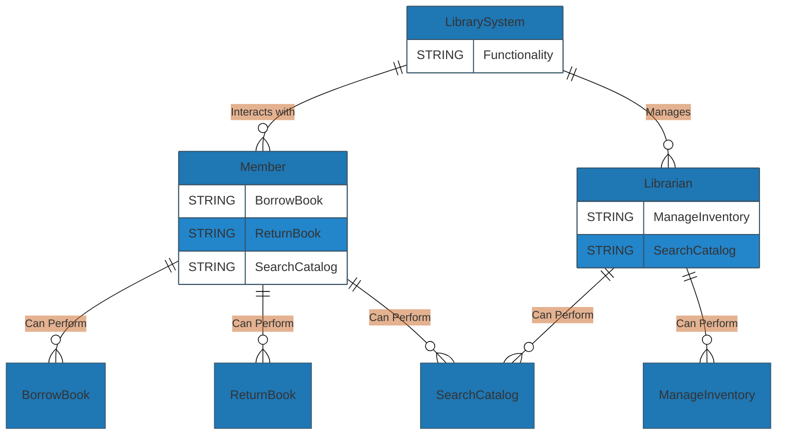

```mermaid
%%{init: {'theme': 'base', 'themeVariables': {'primaryColor': '#1f77b4', 'edgeLabelBackground':'#ffffff'}}}%%
erDiagram
    Member {
        STRING BorrowBook
        STRING ReturnBook
        STRING SearchCatalog
    }

    Librarian {
        STRING ManageInventory
        STRING SearchCatalog
    }

    LibrarySystem {
        STRING Functionality
    }
    
    LibrarySystem ||--o{ Member : "Interacts with"
    LibrarySystem ||--o{ Librarian : "Manages"
    Member ||--o{ BorrowBook : "Can Perform"
    Member ||--o{ ReturnBook : "Can Perform"
    Member ||--o{ SearchCatalog : "Can Perform"
    Librarian ||--o{ ManageInventory : "Can Perform"
    Librarian ||--o{ SearchCatalog : "Can Perform"
```
